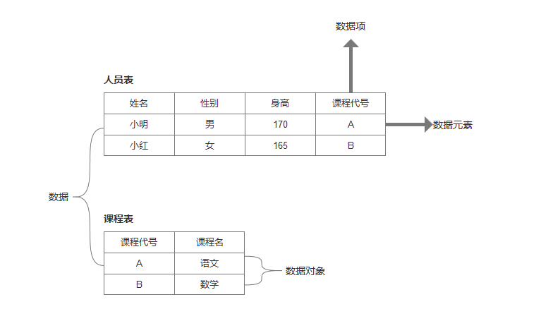

### 1、数据

描述客观事物的符号，信息载体，是计算机中可以操作的对象，是能被计算机识别，并输入给计算机处理的符号集合。包括数值型数据/非数值型数据。

### 2、数据元素

组成数据的、有一定意义的基本单位，在计算机中通常作为整体处理。也被称为记录，结点，顶点。
**与数据的关系**：是数据集合的个体。

### 3、数据项

一个数据元素可以由若干个数据项组成，数据项是不可分割的最小单位。

### 4、数据对象

性质相同的数据元素的集合
**与数据的关系**：是数据集合的子集。

### 术语间的关系


> 图片来源[数据结构之数据、数据元素、数据项、数据对象之间的关系](https://zhuanlan.zhihu.com/p/379742578)


### 数据结构的组成
- 数据元素之间的逻辑关系，称为逻辑结构
- 数据元素及其关系在计算机内存中的表示（映像），称为数据的物理结构或者叫储存结构
- 数据的运算与实现，即对数据元素可以施加的操作以及在这些操作在相应的储存结构上的实现

#### 逻辑结构
- 描述数据元素之间的逻辑关系
- 与数据储存无关，抽象出的数学模型

**分类一**
- 线性结构：有且仅有一个开始和一个终端结点，并且所有结点都最多只有一个直接前趋和一个直接后继。
- 非线性结构：一个结点可能有多个直接前趋和直接后继

**分类二**
- 集合结构：数据元素同属于一个集合
- 线性结构：存在一对一线性关系
- 树结构：一对多的层次关系
- 图结构：多对多的任意关系


#### 物理结构/储存结构
- 数据元素及其关系在计算机储存器中的结构
- 数据结构在计算机中的表示

**分类**
- 顺序储存结构：用计算机中一片连续的储存单元，逻辑关系由储存位置表示
- 链式储存结构：一组任意的储存单元储存数据元素，逻辑关系用指针表示
- 索引储存结构：储存结点信息时，建立附加索引表
- 散列储存结构：根据结点关键字直接计算出结点的储存地址

#### 两者关系
- 物理结构是逻辑关系的映像与元素本身的映像
- 逻辑结构是数据结构的抽象，储存结构是数据结构的实现
- 结合形成数据结构关系

### 数据类型基础

高级程序设计语言要明确说明数据类型，这种数据类型某种程度上**规定**了在程序执行期间**变量**与表达的**所有可能的取值范围**，以及在这些范围内允许的**操作**

约束取值范围与操作

### 数据类型
是一组性质相同的值的集合以及定义于这个值集合上的一组操作的总称

### 抽象数据类型（`ADT`）
是指一个数学模型以及定义在此模型上的一组操作

#### 抽象数据类型形式定义
**形式定义**
`D,S,P`三元组表示
- D是数据对象
- S是D上的关系集
- P是对D的基本操作集
数据对象（伪代码）-数据关系（伪代码）-基本操作

**基本操作定义格式**为

 - 基本操作名【参数表：赋值参数（提供输入值）/引用参数&，还可以返回操作结果】
 - 初始条件（执行前数据结构和参数要满足的条件）【条件描述】
 - 操作结果（操作完成后，数据结构的变化与返回的结果）【结果描述】


 ```抽象数据类型定义
 ADT Circle {
  数据对象：D={r,x,y|r,x,y均为实数}
  数据关系：R={<r,x,y>|r为半径，<x,y>为圆心坐标}
  基本操作：
  Circle(&C,r,x,y)
       操作结果：构造一个圆
  double Area(C)
     初始条件：圆已存在
     操作结果：计算面积
  double Circumference(C)
     初始条件：圆已存在
     操作结果：计算周长
 }ADT Circle
 
 ```

### 结构梳理


>来自王卓老师课件


#### 抽象数据类型的实现
- 利用处理器中已经存在的数据类型说明结构，用已经实现的操作组合为新的操作